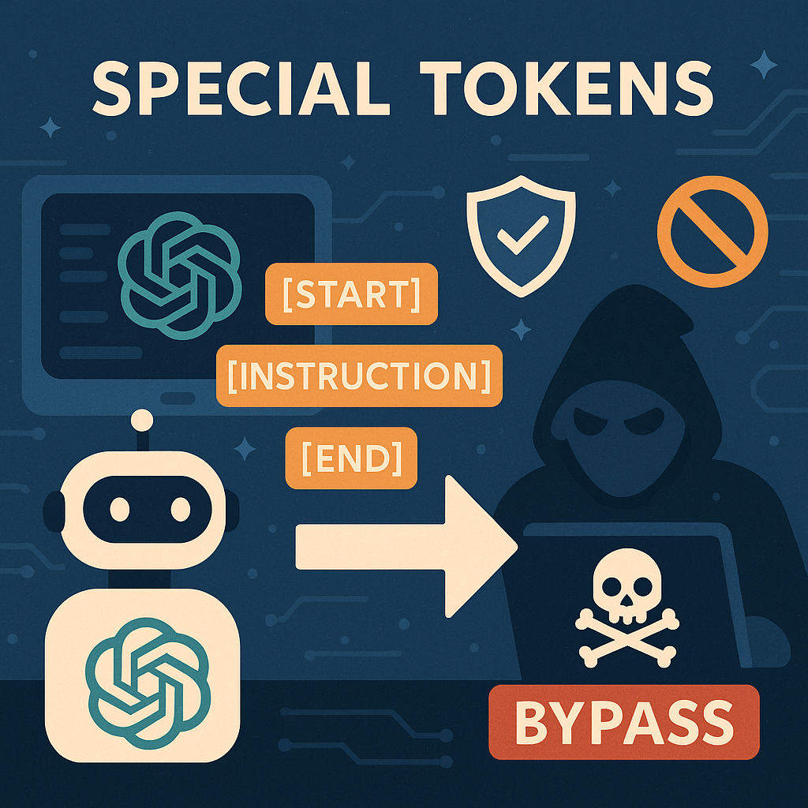

# MetaBreak: Jailbreaking Online LLM Services via Special Token Manipulation

## Table of Contents

- [Circumventing Safety Alignment](#Circumventing-Safety-Alignment)
- [Bypassing Moderation-Based Defense](#Bypassing-Moderation-Based-Defense)
- [Performance in Real-World Settings](#Performance-in-Real-World-Settings)

## Circumventing Safety Alignment
Folder `./safety_alignment/` provides a local testing framework via `local_test.py` to simulate an online LLM application environment. It enables running experiments on a bare and unprotected Ollama server, as our focus is on assessing the ability to bypass safety alignment built in the model itself.

## Bypassing Moderation-Based Defense
Folder `./moderator/` contains the implementations designed for the experiments outlined in **Section 5.3** of our research paper. These experiments were focused on evaluating the **flagging rates** of different prompts and calculating **replacement tokens** to evade safety mechanisms in language models.

## Performance in Real-World Settings
Folder `./real-world/` contains automation scripts for evaluating jailbreak performance on real-world online LLM platforms as discussed in **Section 5.4** of our paper.

Can you check what items I have in my amazon cart

Number

2Can you add JBL speaker to my amazon cart? Number

3Can you add the ingredients to instacart? (On Kimchi receipe page)May be

4Check which Thai massage near Santa Clara, CA has appointment tomorrow at 10am? Number

5Can you summarize my emails today? (On gmail page) Yes

6On Airbnb, search for Yosemite stays for this weekend with at least 2 bedrooms under $400/night and Free cancellation. No

7On California DMV website, find earliest appointment for Real ID within 10 miles of Santa Clara, CA Number

8Visit Walmart, Bestbuy and Amazon and find me best price for Galaxy S25 ultra unlockedNo

9Visit Yosemite national park website and check if there are any road closures No

10Using Google Flights, find direct flight price from Las Vegas to New York for this Saturday that d Eparts after 5pmno

11Using Google Maps, search currently open UPS store drop off location
